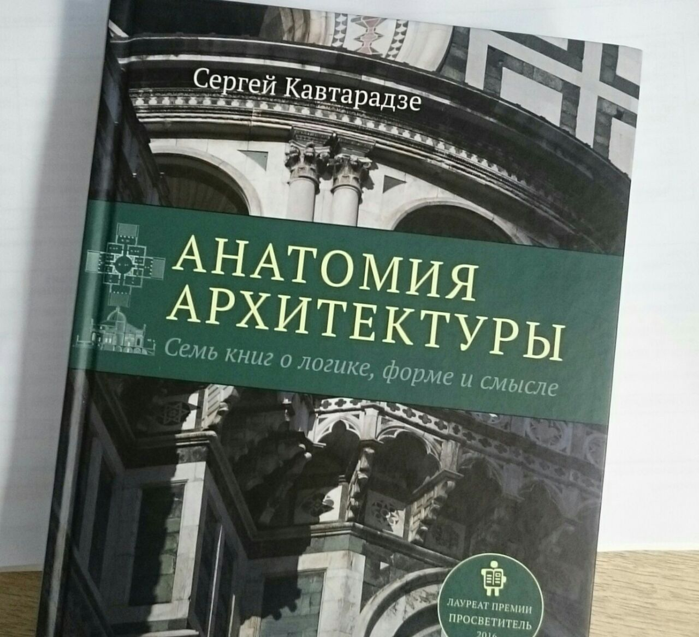

## Новое сообщение

---
layout: post
title: ""
date: 2017-08-17
---

Всё-таки Виппер, а точнее стиль изложения в книге "Введение в историческое изучение искусства" вещь достаточно специфичная для восприятия. Объясняется это просто: это сборник лекций, читаемых профессором. Необходимо максимально концентрироваться на тексте, делать смысловые паузы, чтобы обдумать тот или иной момент, и нахрапом "вот щас прочитаю архитектуру быстро" осилить книгу у меня не выходит.  

Помимо этого, нужно держать под рукой какое-то устройство с hd-экраном и выходом в интернет, чтобы посмотреть картину, фотографию здания или просто определение в словаре.  

Закончил вчера читать раздел об архитектуре в его книге. Читать закончил, осталось чувство, что ничего не понял. Но как только продолжил читать "Анатомию архитектуры" Сергея Кавтарадзе — моментальный эффект узнавания, понимания: ах, вот о чем Виппер или "да-да, знаем-знаем, проходили". Получается такой книжный семинар по книжной лекции. Такие дела.

Введите текст, пользуясь [разметкой Markdown](http://daringfireball.net/projects/markdown/). Используйте панель инструментов над полем или нажмите на кнопку **?** для получения информации о форматировании.
